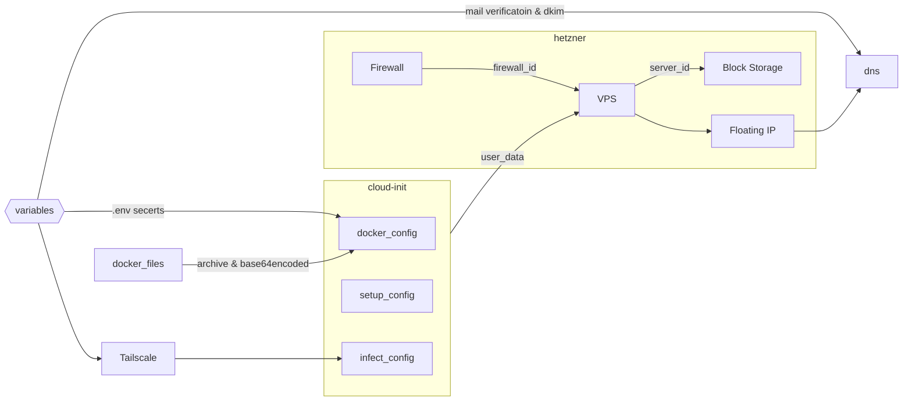

# Overview 

This Terraform configuration is designed to provision and manage infrastructure for personal use. It utilizes [Terraform](https://www.terraform.io/), [cloud-init](https://cloud-init.io/), [NixOS](https://nixos.org/) (via [nixos-infect](https://github.com/elitak/nixos-infect)), and [Docker](https://www.docker.com/) to deploy services.

# Externally Managed Services

## Porkbun

[Porkbun](https://www.porkbun.com/) is my current domain name registrar & domain name manager. For this context of this project I only own the `jpatrick.io` domain name.

## Hetzner Cloud

[Hetzner](https://www.hetzner.com/cloud) is a German based Virtual Private Server(VPS) provider. In 2021 they opened a data center park in Ashburn, VA. The VPS instances are [inexpensive](https://www.hetzner.com/cloud/#pricing) with good reliability. Comparable VPS on [Digital Ocean](https://www.digitalocean.com/pricing/droplets) costs roughly 4.4 times more. Hetzner does not have a good record on censorship, and has repeatedly complied to censorship attempts from  [Roskomnadzor](https://en.wikipedia.org/wiki/Federal_Service_for_Supervision_of_Communications,_Information_Technology_and_Mass_Media) removing opposition or Pro-Ukrainian media organizations. This  [has](https://en.wikipedia.org/wiki/Hetzner#Russian_complaints_about_Glavcom.ua) [happened](https://en.wikipedia.org/wiki/Hetzner#Blocking_%22Novaya_Gazeta%22) [repeatedly](https://en.wikipedia.org/wiki/Hetzner#Blocking_Ukraine_War_information).


## Tailscale

[Tailscale](tailscale.com) is a zero config VPN built on top of WireGuard. Summarizing is difficult but it allows creation of a mesh VPN with access control rules using ACLs. 

## 1Password

[1Password](1password.com) is a multi-platform password manager made by AgileBits Inc. All access credentials are store in a single purpose vault. Access to the vault can be granted either by [1Password's CLI tool `op`](https://developer.1password.com/docs/cli/) or using [Service Accounts](https://developer.1password.com/docs/service-accounts/get-started/#create-a-service-account). 

## ProtonMail

I use [ProtonMail](http://protonmail.com/) for my mail provider of choice. Fastmail would be my first choice, if it was located pretty much anywhere but Australia. 

ProtonMail does not offer IMAP due to its designed. Instead you need to either user there App, or use a "Proton Bridge" to create a local IMAP.

# Prerequistics

Before using this Terraform configuration, ensure you have the following

* Access credentials for all provider services (e.g. DNS, VPS, etc). A full list can be found in `terraform/terraform.tfvars.templ` file.
* The following software must be installed on your local machine
  * [Terraform](https://www.terraform.io/)
  * [Just](https://github.com/casey/just)
  * [1Password CLI](https://developer.1password.com/docs/cli/)


# Configuration Structure 

```bash
infrastructure
├── cloud-init
│   ├── docker.cfg.tftpl
│   ├── infect.cfg.tftpl
│   └── setup.cfg.tftpl
├── docker
│   ├── docker-compose.yml
│   ├── ...
│   └── web
│       ├── Caddyfile
│       ├── docker-compose.yml
│       └── site
├── nix
│   ├── docker.nix
│   ├── host.nix
│   └── tailscale.nix
├── readme.md
├── terraform
│   ├── cloud-init.tf
│   ├── dns.tf
│   ├── github.tf
│   ├── infrastructure.tf
│   ├── justfile
│   ├── main.tf
│   ├── tailscale.tf
│   ├── terraform.tfvars.templ
│   └── variables.tf
└── tmp
```

# Getting Started / Deploying

TLDR

1. Clone this repository to your local machine.
2. `cd` into repository.
3. Run `just terraform/init` to initialize the working terraform directory.
4. Run `just terraform/plan` to preview changes Terraform will make.
5. Run `just terraform/apply` to apply all changes.

## Just 

The `justfile` located in the `terraform/` directory is the task runner for this. It manages dependency and follow up runners for the three primary targets; `init`, `plan`, & `apply`. For `apply` it does the following.

1. Injects access tokens form 1Password into `terraform.tfvars` file
2. Grabs most recent last known `terraform.tfstate` object.
3. Applies terraform state change.
4. Saves updated `terraform.tfstate` back into vault.

## Terraform Structure 




#  Security Considerations

* Using a password manager is not a grantee that the contents will remain safe. Do not unlock your vault on untrusted system. Don't share you passwords or tokens with others. Don't use a dumb/weak password. & *Do not reuse your master password*.

* Both the tfstate & populated tfvars will be stored locally on your machine after you've the `just` run targets. They will be backed up in 1Password, so it may be better to remove them regularly.

* Don't use root for Docker containers.

* Regularly run updates to make sure you're running current.

* The authorized SSH keys are all keys associated with your this GitHub Account. There is a hash to catch modifications, but you both need to maintain good stewardship GitHub access, & access to all keys associated with GitHub.

# Support

For questions or issues related to this Terraform configuration, please open an issue in this repository or contact the maintainer directly.

# Disclaimer

This Terraform configuration is provided as-is, without any warranties or guarantees. Use at your own risk.

# License

This project is licensed under the MIT License. Feel free to modify and distribute it as needed.
